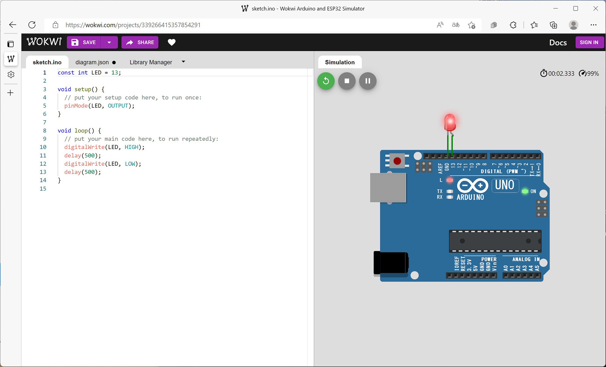

# Arduinoで遊びたい人が「Arduinoをはじめよう」書籍を始めるまでの話

ふーれむ@ditflame

## はじめに

こんにちは。ふーれむと申します。この本を手に取られる方は大きく

 * 積み基板が積まれていて消化に困っている or 普通にマイコンボードを触っている方
 * こういうので遊んでみたいんだけどよくわからなくてこの本を手に取られた方

の２種類に分かれるだろうと思っているのですが、後者の「遊んでみたいんだけどよくわかんないよ～」という方のための記事が同人誌版ではありませんでした(元々この本って「そういう層はこの本買わないんじゃ？」という前提だったので……)。

本章はそういった方に向けての記事になります。

## 実際に遊ぶためにはまずどうすべきか、それが問題だ

まずそもそもの話として、マイコンボードで遊ぶためには、まずマイコンボードを買わなくてはいけません。更にマイコンボードだけでは遊べないので、ボードにつなぐ各種電子部品や、ジャンパワイヤ、ブレッドボードなども最初に必要になります。色々と細かく買い揃えるのが、まず初心者の方にはハードルとして高いですよね。

なお実は筆者もあまりマイコンボードを持っておらず[^cross]、必要になれば買えばいいか～と思っていたのですが、先日とある理由[^reason]により共立エレショップ[^eleshop]さんの *Arduinoをはじめよう「Arduino UNO セット」 KP-UNOST03*[^unoset] を買ってしまいました。えへへ……

[^cross]: STM32しか持っていなかったので、巻末のおもしろ企画であるクロスレビューにも参加していません 笑

[^reason]: 実は妻が実家で飼っていたペットのうさぎが狭心症になったため、酸素濃度を上げる装置を導入したそうなのですが、装置にフィードバック制御機構がついておらず、義母が手動で濃度調整をしている……という何とも面倒くさい運用になっていて結構大変そうだったため、自動化しようとしてみた　という経緯になります。ただ、キットを買った後、作る間もなくうさぎは10歳の天寿を全うしたこともあり、実際に作るには至らず、という顛末でして、まあそういうものだよな……と。

[^eleshop]: https://eleshop.jp/shop/

[^unoset]: https://eleshop.jp/shop/g/g402648/ なお１万円弱ぐらいしちゃうのです。それでも最初はこういう揃いものを買った方が楽だと思いますけれど。

セットはこんな感じのパッケージになります。ぴったり合うケースも付いてくるので大変いいですね（すぐパーツが散らばりがちになりますからね）。


なお、今現在(2022/8/7時点 筆者調べ)では上記セットは欠品しているようなのですが、後継セットである *Arduinoをはじめよう「Arduino＆書籍＆部品セット」 KP-ARDST03* [^leoset] が販売されているようです。ArduinoがArduino Leonardoになっているので、より色んなことが遊べる模様（最大の違いは本に沿ってキーボードデバイスとか作ったりできない→できる、ですね）。

[^leoset]: https://eleshop.jp/shop/g/g402375/

さて、せっかくなのでLチカ[^ledchika]をしてみました。

[^ledchika]: 困ったときはとりあえずLチカ。とりあえずビールみたいなやつです。

スケッチ(Arduino界ではソースコードのことをこう言うらしい)をこうして……

```c:LEDBlink
const int LED = 13;

void setup() {
  // put your setup code here, to run once:
  pinMode(LED, OUTPUT);
}

void loop() {
  // put your main code here, to run repeatedly:
  digitalWrite(LED, HIGH);
  delay(500);
  digitalWrite(LED, LOW);
  delay(500);
}
```

LEDをarduinoに繋いで……　こうじゃ！


チカりましたね。なお、このキットだと書籍の結構な割合の電子工作が実際に作って遊べるようです（ようです　というのは時間がなくて遊べていないのです……）。

## マイコンボードを買わなくても実は…

先程「マイコンボードで遊ぶために、まずマイコンボードを買わなくてはいけません」と記載しましたが、あれは事実ではない（かもしれない）ことを最近知りました。

なんと、フリーで遊べて更にWeb上で動いてしまうシミュレーターがあります！（とはいえ、マイコンボードを買わない場合は物理的に組んで遊べないですので、あながち間違っているわけでもないのですが）

サイトは　https://wokwi.com/　[^wokwi] になるのですが、Arduino UNOのシミュレーターもこちら[^wokwiuno] にあります。


この画面に対し、上の章で書いたスケッチを入力、LEDをつけて同様に動かしてみると……こうなります。

[^wokwi]: ウォクウィと呼ぶらしい。

[^wokwiuno]: https://wokwi.com/projects/new/arduino-uno



うぉー！チカってる！(紙面ではチカっているのをお見せできないのが残念です！あまりに残念なのでこのページを読まれた方、ぜひWeb上でも遊んでみてくださいね！)

なんとバーチャルでもチカれます。ちょっと気軽に試したいときにも使えますし、何といっても無料なのが最高にいいですね。

## おわりに

最近は本当に何でもありますね。Webで動くフリーのシミュレーターがあることに気づいたときは「なんだこれ！」って口走ってしまった覚えがあります。それほどの衝撃でした。

筆者としては、この記事がマイコンを始めてみたい人の後押しになれば大変嬉しい限りです。
