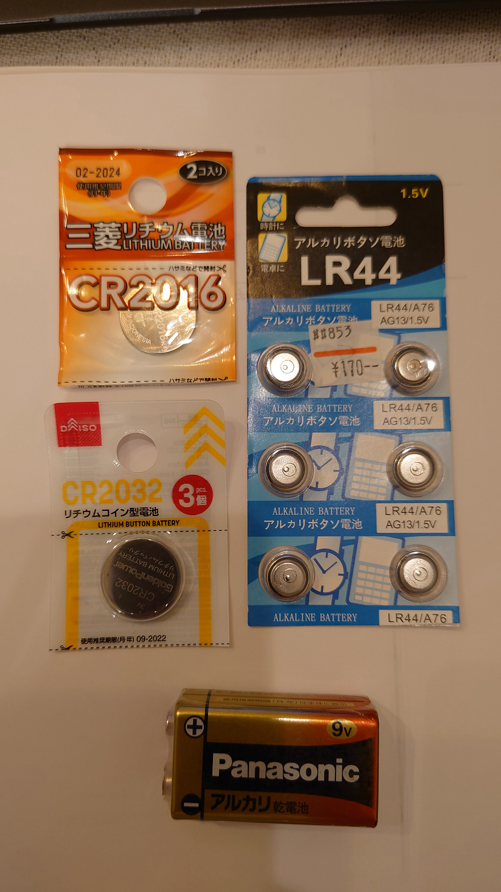
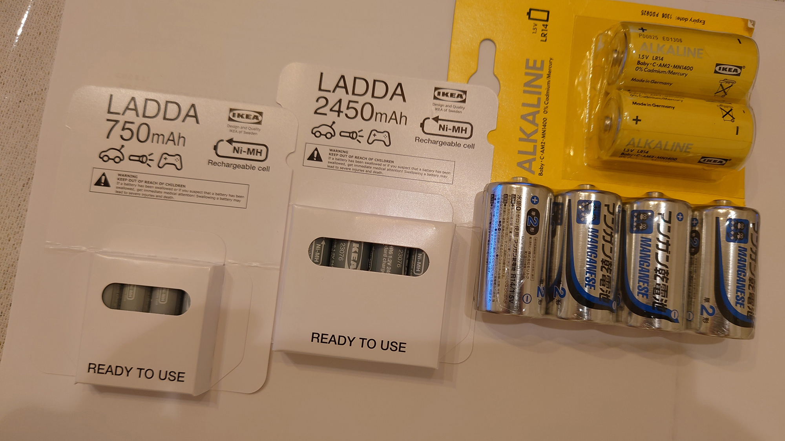
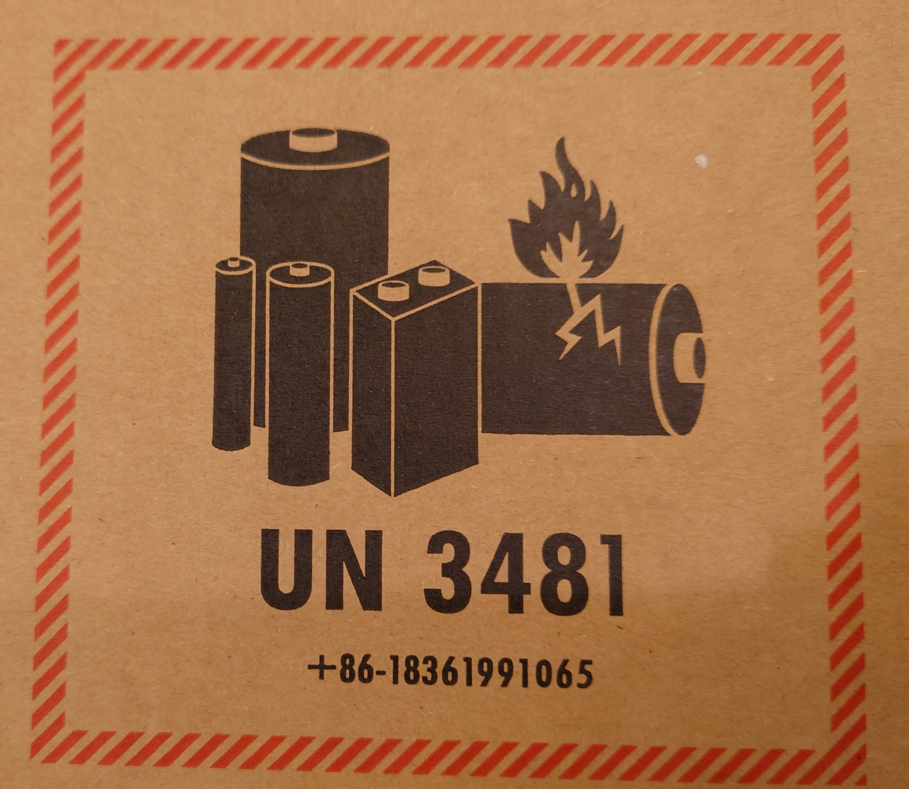
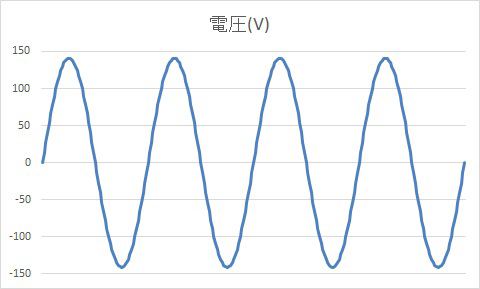
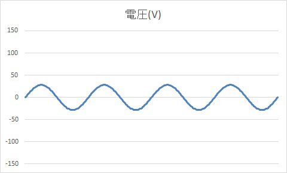
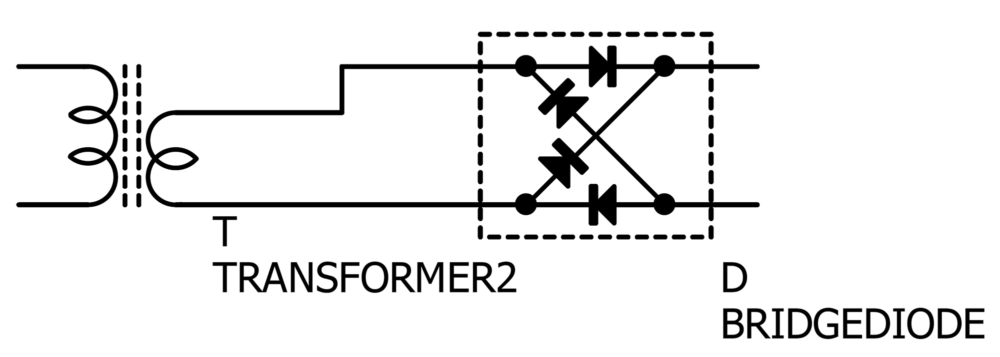
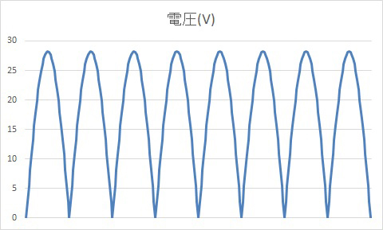

# 電子工作における各種電源について

ふーれむ@ditflame

## はじめに
こんにちは。ふーれむと申します。

昔はアマチュア無線をやっていたのですが、最近は遠ざかっています。

また、本職はシステムエンジニアですが、組み込み系のプロジェクトに5年強参画していたり、所持資格的に積み基板に関係がありそうなものでいうと、アマチュア無線技士３級と電気通信の工事担任者デジタル一種、情報処理技術者試験のエンベデッドシステムスペシャリスト、を持っていたりします。

電子工作もやりたいなーと思いながらも気軽にやりにくいので少し遠ざかり中（と言いながらもマイハンダゴテとハンダ吸い取り器は普通に家にあるんですけどね）。

## どんな素晴らしい電子回路でも電源がなければただの箱である

電子回路やサーバ界隈でよく言われる格言があります。「電源がなければただの箱」というやつです。

と言いながらも、電源については弱電（いわゆる電子回路界隈）に限定されるわけでもなく、また強電（いわゆる家庭用電源、100Vのコンセントとかの電気系）に限定されるわけでもないという事情が、普通の電子工作とは一線を画して特殊な知識分野を形成している様に思います。

なお、どんな素晴らしい回路を作っても電源周りの問題が解決しないと、設置や運用の際に困るケースが出てきがちですね（エンベデッドシステムスペシャリストの試験問題でも簡単な内容にはなりますが、電源周りの内容が設問として問われることがあります）。

ここでは簡単に、電源に関するトピックについてまとめてみたいと思います。

## 電源には直流電源と交流電源がある

電源には直流電源と交流電源があります。メチャクチャ簡単に言うと、電池とコンセントです。

それで終わってしまってもいいのですが、記事として成立しませんね(*´σｰ｀)ｴﾍﾍ

では、色々な電源について見ていきましょう。

## 直流電源の基本　電池

まず、直流電源の代表格である電池について見ていきましょう。

### 電池といえばマンガン電池とアルカリ電池

一般的にまず思い浮かべる電池はたいていこの二つでしょう。

 * マンガン電池
 * アルカリ電池

これらの電池の電圧(公称電圧)は1.5Vとされていますが、封を開けた瞬間の電圧は厳密には1.6V出ます。また、放電に従ってゆっくり電圧が降下します。あらゆる電池においてこのような放電特性になります。

電池のサイズとしては単1から単5まで形状が一般的であり、一応国内には正式な規格ではないものの、単6電池という形状もあります。

少し変わったものでいうと、006P型乾電池という箱型の乾電池もあります。ラジコンのプロポ（無線送信機）などで使われていることがあります。この電池は公称電圧9Vなのですが、理屈としては簡単で、単にアルカリ電池ないしマンガン電池を6つ直列にパッケージングしているだけのものです。

　

基本的にこれらの電池は一次電池と呼ばれ、放電しきると捨てるしかないとされています。

なお、マンガン電池にはしばらく休ませると電圧が少しだけ回復する性質があります。この回復効果はアルカリ電池にはありません。

なお、マンガン電池とアルカリ電池は電池の構成としては、非常に近いものです。電極は次の通りとなっています。

* マンガン電池：二酸化マンガンと亜鉛
* アルカリ電池：二酸化マンガンと亜鉛粉

大きな違いとしては電解質が違う、ということになるようです。

乾電池に限りませんが、電池は一般的に放電をしすぎて過放電状態になると、シール（要は乾電池の容器）が腐食、破損し、液漏れを起こす問題点があります。

### メジャーではないかもしれない一次電池

実はそこまでメジャーではない（というと怒られてしまうような気もする）のですが、一次電池には次のような電池もあります。

**アルカリボタン電池**

公称電圧は1.5Vです。電極は二酸化マンガンと亜鉛です

**リチウム一次電池**

公称電圧は約3Vです。二酸化マンガンかフッ化亜鉛と、リチウムです。お値段が少々高いですがアルカリ電池の倍の電圧を取れるので、電池の本数が半減し軽くなったり省スペースにできます。

釣りの電子ウキ（光るタイプのやつ）用の電池などもこのタイプですね。おそらく電池1本でLEDの電圧を満たせるのが嬉しいのだろうなぁ…と。

**酸化銀電池**

公称電圧は1.55Vです。酸化銀と亜鉛です。電圧が下がりにくい性質があることと、電気容量（放電できるエネルギー量）が多いことが知られており、時計の電池などによく利用されています。

**空気亜鉛電池**

公称電圧は1.4Vです。電池の中にある亜鉛と空気中の酸素との化学反応で電気を発生させます。非常に軽いという特性があり、主に補聴器の電池としてよく利用されています。

### 電池の実際の写真

電池の写真もせっかくなので見てみましょう。上がボタン電池ですね。リチウム電池と**アルカリボタ「ソ」電池**です。

**アルカリボタ「ソ」電池**という表記は買ってから気づいたのですが、大阪のでんでんタウン（電気街）にて入手、10個170円でした。安定の中華製です。一応問題なく使えています。

なお電池は空中に晒すと自然放電してそのうち液漏れして辛いことになるので、基本的に保管する場合はパッケージごと保管するのがいいです（開けてしまった電池については極の部分をテープなどで絶縁することである程度、自然放電による損耗を防げます）。

006P乾電池は下の写真の箱型形状のものになります。安心のPanasonic製。

IKEAの新しい電池(充電式：ニッケル水素二次電池)とアルカリ乾電池、マンガン乾電池ですね。

正式情報ではないのですが、IKEAの新しいニッケル水素二次電池はFDK(古河電工系列の電池とか作ってる会社)によるOEM供給で国産の電池らしい…という話が出ていました。実際私も使っていますが、問題なく使えすぎてしまってすごい！となっています。

充電式電池デビューがまだの方はぜひ！オススメできます。

#### 俺のミニ四駆が２割遅い件（アルカリ電池用充電器について）

じつはアルカリ乾電池は充電できないと一般的に言われており、各種教科書などにもそう記載されているのですが、世の中には**アルカリ乾電池の充電器**なるものが存在します。

これ、本当にアルカリ乾電池を充電できてしまうのですが、法の縛りによるものです。日本は生産物責任法（PL法）がある関係で、もともと充電用に作っていないアルカリ乾電池を充電すると液漏れの危険性が無視できないらしく、国内では基本的に「アルカリ電池は充電できない」という表記にせざるをえないのだそうです。

また、アルカリ電池の充電器は普通の二次電池の充電器とは少し回路構成が異なるそうで、**普通のニッケル水素やニッケルカドミウム電池用の充電器では、絶対に充電を行ってはいけません。**

さて、アルカリ電池を充電できると、経済性の観点で単純に嬉しい…ような気もするのですが、「液漏れの危険性が無視できない」電池って、実際のところどこに使うのが一番妥当なんでしょう？

個人的にヒントになるだろうなと思っているのは「電池を入れて**ほったらかしで利用しない**」電気製品です。

たとえばミニ四駆などのおもちゃですと、電池の起電力はそのままおもちゃのスピードやトルクに直結します。下にも記載していますが、充電式電池の起電力は1.25Vだったりしますので、「それだけで目を当てられないぐらい」ミニ四駆が遅くなります。具体的にはコースにに設置されている、宙返りするようなループ状の坂を登りきれなかったりとかします（笑）。

私も小学生の頃にはそんなことはつゆしらず、「俺のミニ四駆はなぜこんなに遅いのだ…」と思っていた頃がありました。
こういうケースにおいて、アルカリ電池を再充電して使うのは非常に優位性があるように思います（あくまでも、くれぐれも自己責任で使ってくださいね）。

## 充電できる電池　二次電池

これまでの一次電池と異なり、何度も充放電する前提で作られており、充電して何度も使える電池を二次電池と呼びます。

二次電池の一次電池との大きな違いは、充電ができること。原理や挙動は以下の通りです。

 * ＋極に＋、－極に－となるように電気を流すと、放電したときと逆の化学変化が起きてもう一度電気が発生するようになる
 * 上記の充放電を行って何度も利用する前提でシール（電池の容器）の厚みなどが設計されている

したがって、厳密にいうと「充電しようとしてもメモリ効果が顕著に起きすぎてすぐ充電できなくなるのが一次電池」ということになるようです）。

さて、ここでは代表的な二次電池について見てみましょう。

### ニッケル・カドミウム電池

正極にオキシ水酸化ニッケル、負極にカドミウム、電解液に水酸化カリウム水溶液（苛性カリ・KOH aq.）を用いており、二次電池の代表格です（でした？）。
一般的なニッケル・カドミウム電池は、次のような特性があります。

　

●うれしい点

 * 内部抵抗（電池の中での抵抗値）が低く、二次電池としては大電流が出しやすい
 * 使い始めから放電終止直前まで安定した放電を行える（電力が比較的安定する）
 * 二次電池としては比較的雑に扱っても意外にちゃんと使える
 * 低温環境でもそれなりに使える（0℃～20℃の範囲でも使用できる）

●うれしくない点

 * 電圧が1.2~1.25Vなので、乾電池の代わりに使うと実はちょっと電圧が足りない（回路がうまく動かない/モーターのパワーが足りないかも？）
 * メモリ効果と言われる現象が起きることがわかっており、フル充電→使い切り→フル充電→使い切り、を繰り返すような使い方でないと充電容量が減る
 * カドミウムが廃棄時に環境影響がある（いわゆるカドミウム環境公害である「イタイイタイ病」を起こす）

参考：ニッケル・カドミウム電池[^nicd]@Wikipedia

[^nicd]: https://ja.wikipedia.org/wiki/ニッケル・カドミウム蓄電池

### ニッケル・水素電池

正極にオキシ水酸化ニッケルなどのニッケル酸化化合物、負極に水素を含んだ水素吸蔵合金または水素化合物を用い、電解液に濃水酸化カリウム水溶液 (KOH (aq)) などのアルカリ溶液を用いる二次電池です。
今の二次電池の代表格だろうなぁと。

　

●うれしい点

 * カドミウムを使っていないので環境にやさしい
 * 電圧がニッケル・カドミウム電池と同じ「1.2V」で互換性がある
 * ニッケル・カドミウム電池より大容量にできる

●うれしくない点

 * 完全に放電してしまうと電池を傷めてしまう（ただしEneloopはダメージが比較的少ないらしい）
 * メモリ効果もある
 * 加熱時や過放電時に水素ガスを発生してしまうので、完全密閉環境（水中ライト、防ガスライトなど）では使用禁止らしい（改善は進んできているそうだけど）
 * ニッケル・カドミウム電池ほど扱いが簡単ではない(特に充電の観点として)

参考：ニッケル・水素電池[^nimh]@Wikipedia

[^nimh]: https://ja.wikipedia.org/wiki/ニッケル・水素充電池

### 鉛蓄電池

現在では正極（陽極板）に二酸化鉛、負極（陰極板）に海綿状の鉛、電解液として希硫酸を用いる二次電池です。

１セルあたり2Vの電圧が出せます。車だと6セルあって12V（大型車だと電池ユニットをふたつつけて24Vになっているものもありますね）。

車(EVじゃないやつ)とか原付に乗ってるやつです。ハイブリッド車や電気自動車の「バッテリー」ではなく、エンジンをかけるときに使うバッテリーです。最近ではあまりやらないかもしれないですが、自動車のバッテリーが上がる、というときのものです。また、IT系だと、徐々にLi-Ionに切り替わってきているとはいえ、UPSの中に大量に入ってます。

　

●うれしい点

 * 大電流が取り出せる(※これが嬉しいので、車載バッテリーとして使われています)。
 * 充放電の観点からいうと結構大味に充電・放電されてそうだけど、特にすぐ壊れるわけでもなく大丈夫ですよね。非常に充放電に対して強い特性があります(EV乗ってない人は可能であれば、走行中のシガープラグの電圧を測定してみると面白いと思います)。
 * 自己放電が少なく、満充電状態で劣化しにくい特性があります。

 自己放電が少なく、満充電で劣化しにくいという特徴は、使いながら充電するという用途に向きます。UPSのように、常に満充電にして使うような用途、かつバッテリー劣化が装置の寿命を決めるような用途にとって非常に嬉しい特性です。また、定電圧充電、定電流充電とも可能で、充電回路が非常に簡単です。

●うれしくない点

 * 中に入っている電解液が希硫酸なので取り扱い注意
 * 充電したら水素が発生する
 * 重い（重い割にエネルギー密度が小さい）

これらうれしくない点の中でも「充電したら水素が発生する」が結構悩ましく、使い方に注意が必要です。たとえば車のバッテリーが上がってしまったときは、ブースターケーブルと呼ばれるケーブルを車のバッテリー同士で接続し、他の車にエンジンスタートのための電気を分けてもらうことになるのですが、この際「＋極（赤）同士はブースターケーブルで直結したほうがいいが、－極（黒）はアースされているので、端子の片方を車のボディにつなごう」とされています。これは充電時に発生した水素ガスにスパークが飛んで爆発が起こるのを防ぐため、とされています。

この対策としてUPSなどでは、鉛シール電池と呼ばれるように、充電時に発生する水素を触媒で水にしてしまうことで完全密封可能にしたバッテリーを使います。

そして、鉛蓄電池は、正極材料、負極材料とも鉛です。ご存じの通り、鉛は非常に重い金属です。重い割にエネルギー密度が低いという問題があります。持ち運びするような用途には決定的に向かないのです。ドローンなんかのように飛ぶものには使えませんし、走る・動く系のものにも使いづらいですね。重い分燃費が悪化したり、モーターのパワーが必要になったり…

重量エネルギー密度という指標があり、単位はWh/㎏です。簡単には、1㎏のバッテリーからどれくらいのエネルギーが取り出せるかという指標で、30～40Wh/㎏です。ちなみに、ノートパソコンのバッテリーに多用されているリチウムイオン電池は100～240Wh/kgに及びます。ということは、3倍～8倍程度の差がありますね。たとえば50Whのバッテリーを積んだパソコンがあるとして、リチウムイオン電池ならざっくり200g～がバッテリーの重量と計算できますが、鉛電池で実現しようと思ったら1.5kgくらいバッテリーを載せる必要があるということになります。そんなノートパソコン持ち歩きたくないですね。ただし、エネルギー密度が低いということは、自然発火などしにくいので、その分安全ということでもあります。

参考：鉛蓄電池[^namari]＠Wikipedia

[^namari]: https://ja.wikipedia.org/wiki/鉛蓄電池

### リチウムイオン電池

リチウムイオンを用いた二次電池群の総称です。

ノートパソコンやスマートフォンの電池はもう軒並みこのタイプになりましたね。電気自動車などもほぼほぼそうかな…（3代目プリウスまではNi-MH、4代目プリウス(2015～）はリチウムイオンだそうですが)

個人の電子工作のレベルでこのバッテリーをそのまま扱うには辛いのですが、モバイルバッテリーなどではよく用いられていますので、利用する際の知識を得る意味でも特性については確認しておきましょう。

　

●うれしい点

 * エネルギー密度が高い（現在実用化されている二次電池の中で最もエネルギー密度が高い）=同じ容量で軽くできる。
 * 電圧も4Vと高い（溶媒が水溶液ではなく有機溶媒なので）。このため、高電圧が必要なときの電池の本数が減る
 * メモリ効果がない
 * 自己放電が少ない
 * 充電/放電効率が良い
 * 寿命が長い（らしい）
 * 高速充電、大電流放電が可能
 * 使用温度範囲が広い
 * 汎用性が高い（全体的な性能のバランスがいい）
 
●うれしくない点

 * 安全性を確保するには保護回路必須
 * エネルギー密度が高く、コントロールに失敗（急速・過度な充電、過放電、高温）すると発火事故を起こす恐れがある（ノートPCの発火映像とか良くTwitterでバズってますよね…）

なおリチウムイオン電池はエネルギー密度が高いので、箱にリチウムイオン電池内蔵表記が義務付けられていますね。荷物として航空機での運搬するときなどに制約を受けることもあります。

参考：リチウムイオン電池[^Li-ion]@Wikipedia

[^Li-ion]: https://ja.wikipedia.org/wiki/リチウムイオン二次電池

### コラム：全固体電池って何が嬉しいの？

最近よく次世代電池として耳にするようになった「全固体電池」なんですが、これって何が嬉しいのでしょうか？

基本的な電池というのは、構造として＋電極と－電極の間に電解質（ないし電解液）という電気を起こさせるための化学物質が充填されており、これが液体であったり（車載バッテリーに代表される鉛蓄電池は希硫酸でしたね）、不織布に染み込ませた液体（上で示した鉛蓄電池以外の電池はほぼほぼこのタイプでした）であったりするわけです。

とうぜん液体ないし不織布なので、構造上あまり強いものではなく、＋電極と－電極が何らかの理由で短絡(ショート)してしまうと起電力が発生しなくなったり（実際に車載バッテリーだとバッテリーセル単位で発生することが知られています）、逆にエネルギーが蓄えられた状態で金属の針などで貫通してしまうと、発火する危険性もあります。

全固体電池というのは、この電解質の部分を固体にすることで、**バッテリーセルを強固なひとつの固体とする事ができる**のが最大のメリットであろうと考えられます（電気自動車などのバッテリーセルを考えても、当然ながら自動車としての運用に耐えられるバッテリーセルにしようとすると構造を補強する必要があるのに対し、全固体電池になるとその補強が少なくて済むので、車重が軽くなるだろう、というのは普通にありそうなシナリオですね）。
他にも電解質であると当然それは液体なので、水分が揮発したりガスとして放出されたりといった劣化しやすい特性があるのですが、全固体になるとそれも固体なので大分低減されると考えられます。

全固体電池の開発にはレアメタルが必要であることが昨今ネックとなっていたようですが、最近日本のとある企業が世界で初めてレアメタルを必要としない（ナトリウムでそれを実現した）全固体電池の開発に成功[^ナトリウムイオン全固体電池]したようですね。

[^ナトリウムイオン全固体電池]: https://www.neg.co.jp/news/20211118-5221.html

こういった技術が出てきた以上、全固体電池が一般化していくのも時間の問題であるような気がします（なお、余談になりますが、コンデンサーの世界でも電解コンデンサーで似たような話がかつてあり、全固体コンデンサーが高信頼性部品を必要とされる箇所では利用されるようになってきていますね）。

## 電池じゃないもの

世の中には電池以外の電源もありますね。ここでは代表格を押さえておきましょう。

### 光から電気を得る

 * 太陽電池

太陽のエネルギーで半導体に電子の運動を起こしつつ一方向に流すと、あら不思議！**電気が発生しますね**的なやつです。

電流量があんまり取れないので電卓や時計など、少電力ですむ電子回路で使うケースが多かったのですが、昨今はメガソーラー発電所みたいなのもあります。

比較的低消費電力なところには向きますが、発電量が不安定なので、電子工作で用いる場合はキャパシタなどと併用することが必要です。

また、原子力電池というものがあり、核物質と自然崩壊によるベータ線等に反応する蛍光物質、その光を電気に変える太陽電池の組み合わせで発電するものです。完全密封、可動部なし、発熱なしで電源として使えるという面白い特徴があります。

### 運動から電気を得る

 * 交流モーター

自転車の発電機や、発動機式発電機の発電用モーターなどですね。

 * 直流モーター

整流子が要るので交流モーターより構造が複雑になるし、整流子でスパークが起きる関係で電源にノイズが乗りがちなんですが、それを差し置いても使いやすいケースはあるのだろうな…と。

さて、モーターに電流を流すと回転しますが、その逆過程として、モーターの軸を回すと、電気が発生します。交流モーターを回すと交流が、直流モーターを回すと、直流（脈流）が発生します。とはいえ、電子工作という文脈でこれらを電源として使うことはあまりないでしょう。

 * 圧電セラミック素子

よく電子ライターのスパークする部品として入っている奴です。
TOTOのトイレ用リモコンなどで、圧電素子の起電力を用いて電池レスのリモコンを実現している例がありますね（正確には、運動エネルギーではなく、力のエネルギーを電気に変えています。また、積み基板の電源対策としては電圧、電流ともに全然出力できないので、どちらかというと余談ではあるのですが）。

 * フライホイール

運動エネルギーとしてエネルギーをためておく装置をフライホイールといいます。エネルギーを慣性エネルギーとしてためておき、発電機に繋ぐことで電力として取り出すものです。モーターに電力を流してフライホイールに「充電」し、フライホイールでモーターを回し「放電」します。電子工作で使うことは稀ですが。

 * 超大容量キャパシタ

二次電池は化学変化で電気を貯める構造となっているのですが、プロセス的に化学変化を伴うことから、高速充電に向かない性質があります。超大容量キャパシタ（要はクソデカコンデンサ）の場合、化学変化ではなく静電容量により電気を貯めるため、一瞬で充電を完了させることができます。

この特性から、かつては未来のバッテリーの最有力候補だろう、と言われていた時期もあったのですが、なかなか現在でも実用化には至っていませんね。理由は以下の特性によるようです。

* 放電すると電圧降下が急激に起きる（化学変化を伴わないので起電力が急激に落ちていく）
* エネルギー密度を大量に持てない（大量に持ちすぎると、コンデンサの中でスパークしてコンデンサが破壊されるので…）

なかなか、難しいものですね…

## いわゆる所の電源(AC-DC電源)について

さて、ここまで電源の代表格のひとつである電池について記載してきましたが、電池を使って基板を利用・運用すると、いくら電池があっても足りなくなってきますね。

電池で経済性が損なわれるのであれば、どこの家庭にもあり、普段安定した電源として利用できるAC(交流)100V電源（いわゆるコンセントの電気）を使うという手があります。
なお、交流の周波数は関東では50Hz 関西では60Hzです。

ブレーカーが落ちない限りは安定して電力を供給してくれるのはすごいですね・・・・

でも一般的な積み基板になりがちなマイコンボードや電子工作キットって、ほぼほぼ電源入力は直流電源です。
さて、このギャップを埋めるにはどうすればいいでしょうか？

ここでの代表的なアプローチは**AC(交流)電源からDC(直流)電源を作る**ということになるでしょう。

さて、どうやって直流電源を準備すればよいのでしょうか？

### コンセントから直流電源を得よう（AC-DC電源）

家庭用コンセントに代表されるAC(交流)電源からDC(直流)電源を得るためのアプローチを紹介していきましょう。

 * USBのタイプAプラグから5Vを得る

今となっては一番簡単なアプローチです。なお信号線をショートさせると大電流を出そうね、みたいな謎の規格があるらしく、標準だと5V0.5Aしか出ない（のがUSBの規格な）のですが、信号線をショートさせてやるといっぱい電流が取り出せるかもしれません。

※USB Type-Cから、ケーブル端子の部分に機器とのネゴシエーションを行うチップが埋め込まれており、電子工作の電源として使うには大分使いにくくなりましたね…TypeAなどに変換すればTypeAとしては使えるのですが…

 * 使わなくなったAC-DC電源（パソコンのACアダプターとか）から狙った電源を得る

適切なACアダプターが手元にあれば、これも手っ取り早いです。

電圧がACアダプター側で明らかに高すぎる場合は、三端子レギュレータなどを使った降圧回路を組みましょう（ただし降圧させた分は（結論として）全部熱になります。三端子レギュレータにヒートシンクを設置して、必ず熱を逃がそうね！）。

ACアダプタを使う小型の電子機器が古くなって捨てるときも、ACアダプタだけ残しておくと、電子工作用の電源として使えます。もちろんメーカーの保証範囲外ですし、ショートや感電、発火等には十分注意しましょう。ノートパソコン用のACアダプタは19V程度と少し高いですが、小型機器用の電圧は5Vから12V程度であることがほとんどです。ただし、最近のボードは5Vが多いので、やっぱりさらに電圧調整は必要です。

 * PCのATX電源を使う
 
 15番と16番を短絡すると12Vと5Vが事実上取り放題！やったね！

あんまり知られてないような気がするのですが、PCのATX電源はある端子同士を短絡してあげると、簡単に直流電源として利用できます。
古いPCの電源などを再利用する手はアリですね。

ただし、PC用電源だとそこまで電源ノイズにシビアな規格ではなかったはずなので、古い電源だとちょっとノイズが乗ったりというのはあるかもしれません。最近は電源に認証規格があるので大丈夫な気はするのですが、古いPCの電源を用いた場合は、ノイズフィルタなどの経年劣化などもあるかもしれません。それでも、5Vや12Vで大電力が必要なときに、安価な電源として検討の価値は十分にあります。

 * 直流電源装置/安定化電源
 
当然、直流電源装置は市販されています。前面のノブで電圧を任意に調整することができ、容量も数A程度出せるものがあります。電圧の範囲、電流の容量によって価格は変わります。当然、大容量であるほどお値段は高くなります。信頼できる電源を1個持っておくと、動作検証や制作の効率が上がります。

世の中に出回っている数も多いので、中古品を狙うというのもひとつの手です。ヤフオクなどでも比較的安価に入手可能でしょう。
 
 * 自作しちゃう

一応、簡単な安定化電源であれば極端な話、作れなくはないです。

## 安定化電源の自作

基本的な安定化電源というのは、原理については実は結構単純でして、保護回路などを除けば３ステップ（**変圧**、**整流**、**平滑化**）で完結します（実はほぼ中学物理レベルです）。

ここでは基本的な理屈を説明しておきます。電源設計についてはアマチュア無線技士の試験範囲「無線工学」の頻出問題である事もあり、CQ出版社の書籍でカバーしている書籍が数多く出ていますね（どっちかというとトランジスタ技術よりはCQ Ham Radio誌の方に情報が多い印象）。実際に作ってみたい人は、専門書も併せてご確認いただければと思います。

### 変圧回路について

交流100V電圧をトランス（鉄心トランス）を通して狙った電圧・電流に変えよう

ちなみに、トランスによる電圧変換は巻数の比になります。たとえば単純な例ですが、5:1の巻数比だとAC100V入力からAC20V出力が取れます(流せる電流は巻線の太さなどによります)。

なので、回路図上も巻数の多い方が一般的に100V側となっています。

### 整流回路について

交流をブリッジダイオードを用いて脈流に変えましょう。

※なお、ブリッジダイオード（ダイオード４石）ではなく、ダイオード１石を用いた半波整流回路というもう少し簡単な回路もあるのですが、「ダイオードのコストが下がる」以外のメリットが薄い回路構成になってしまうため、本記事では省略しています。

ちなみに、脈流というのは図のように、交流の０からマイナスに本来向かうところをプラスになるよう（今回は割愛していますが、半波整流回路では「流れないように」します）ダイオードで波形を整え、一方向にのみ電流を流すような波形を言います。

### 平滑化回路について

脈流をならしましょう。ならしたあとのイメージが脈流の上からかぶせるように太線で描いたものが電圧の例示となります。なお、この回路のグラフについてはコンデンサのキャパシタンスに大いに左右される面もあるため、概要のみ示しています。

電圧差が1.4V以上ある場合は三端子レギュレータなどで波打ってる部分を削って、更なる平滑化も検討しましょう。ちなみに三端子レギュレータを挟まないと、交流に起因するノイズが必ず出ます。ダイオードをひとつだけ使った半波整流回路を通した場合はACの周波数のノイズ、ブリッジダイオードを使った全波整流回路を通した場合はACの周波数の倍の周波数のノイズが出ます。

### スイッチング電源についても簡単に

よく一般的に売られているスイッチング電源についても、じつは大枠としての理屈には差が少なく、

 * 整流
 * スイッチング(高速な電源のON/OFF動作をスイッチングと呼びます)による変圧器入力の周波数引き上げ
 * 変圧　
 * 整流
 * 平滑化
 * スイッチング回路へのフィードバック回路

という構成で電源回路を実現している（らしい）です。

参考：TDKさんの参考記事[^TDKさんの参考記事]

[^TDKさんの参考記事]: https://www.tdk.com/ja/tech-mag/power/002

変圧において、前述の安定化電源だと周波数が50Hz/60Hzのため、周波数が低い事から鉄心トランスを用います。これに対しスイッチング電源では前述のスイッチング回路により周波数が大幅に上昇するため、セラミックコアを用いたトランスを用いる事が一般的です。

なおスイッチング電源では安定化電源に比べ、周波数を上げることで、素子を小型化することができます。従来大きなトランスを用いていた変圧も、小型のフェライトコアを用いることができるようになっていたり、平滑コンデンサも周波数が高いので貯めないといけない電力量が低減され、結果小さいコンデンサで済むようになります。これらの理由から、大幅に小型・軽量な電源となっています。

三端子レギュレーターは、電力の一部を熱として捨てることで安定化していましたが、スイッチング電源では電力を切り貼りして安定化しています。その結果、各段に高効率になっています。また、三端子レギュレーターなどではできなかった「昇圧」も可能です。

昔のずっしりとしたACアダプタと、最近の小型なACアダプタを頭の中で比較してみてください。とはいえ、ずっしりとしたACアダプタが想像できる時点で、ある程度の年齢がバレてしまうかもしれません…

## さいごに

この章では電子工作全般において頭を悩ませがちな電源周りのトピックについて、ある程度横断的に要点を拾って提示してみました。入門としてこれぐらいの内容がわかっていれば、電源周りの問題についてはある程度クリアできるのではなかろうかと思っています。

この記事が積み基板解消の一助になれば幸いです。

